# @paulshryock/logger

[PSR-3](https://www.php-fig.org/psr/psr-3/)-compliant logger.

There are many other loggers out there. This is the one I use.

## Requirements

| Software | Minimum Version |
| :---     | :---            |
| Node     |                 |
| npm      |                 |

## Installation

```bash
npm install @paulshryock/logger
```

## Usage

```typescript
import { Logger } from '@paulshryock/logger'

class MyService {
  constructor(private readonly logger: Logger) {}

  public logExamples(): void {
    this.logger.emergency('System is unusable.', { lorem: 'ipsum'})
    this.logger.alert('Act immediately.', { lorem: 'ipsum'})
    this.logger.critical('Unexpected exception.', { lorem: 'ipsum'})
    this.logger.error('Runtime error.', { lorem: 'ipsum'})
    this.logger.warning('Deprecation warning.', { lorem: 'ipsum'})
    this.logger.notice('Something interesting happened.', { lorem: 'ipsum'})
    this.logger.info('Something mundane happened.', { lorem: 'ipsum'})
    this.logger.debug('Detailed debug information.', { lorem: 'ipsum'})
    this.logger.log('error', 'Runtime error.', { lorem: 'ipsum'})
  }
}
```

### Recommended log level usage

[](https://mermaid.live/edit#pako:eNp1ksFuwjAMhl8lynm8AIdNQNnoNthhhx3WHUxr2ojGQYkLqhDvPgdoNDatp_S3_y9_LB916SrUY71p3aFswHNBBSn5Jp-FzhwGBSUbR4oQK8VOrVExbJEeCv2lRqMew2h0r6ZXkyjkojAbOFPh5NZiZYCx7W9t2bUn2eaDbS62BQQVnEVuDNUqsNvtJMPB-a3834IepX3uvfOiXgGJ-SS1D_AkpnP1Up-JOvGoetcpQ3sMbGrgeBGodfcLv4jDQJETfpbw-UDM_0Q2xOgjWc4NSHrC6gb8LJaVY1NiAucJ_BInRxv3I3QWpaC4QYXERuKHPjBa1VEXYN3ibezXOBWLvkYq-3RDlm5YDtzlhQuUsOj3kuof7irOrkVZloG5TMw3qc28kTdBK2V9pyWABVPJkh1jc6ElvpUHj-VYgd8WuqCT9EHH7r2nUo_Zd3inu10lK5MZqD1YPd5AG0SVRWLnl5etPS_v6RtWHNzk)

## Support

- [Ask a question](https://github.com/paulshryock/logger/issues/new?assignees=&labels=question&projects=&template=1_ask_a_question.md&title=)
- [Request a feature](https://github.com/paulshryock/logger/issues/new?assignees=&labels=enhancement&projects=&template=2_request_a_feature.md&title=)
- [Document a user story](https://github.com/paulshryock/logger/issues/new?assignees=&labels=enhancement&projects=&template=3_document_a_user_story.md&title=)
- [Report a bug](https://github.com/paulshryock/logger/issues/new?assignees=&labels=bug&projects=&template=4_report_a_bug.md&title=)

## Roadmap

Coming soon.

## Contributing

Contributions are welcome! **Read the [contribution guidelines](https://github.com/paulshryock/logger/blob/main/CONTRIBUTING.md)**, and then submit a pull request.

## Authors and acknowledgment

[Paul Shryock](https://github.com/paulshryock)

## License

[MIT License](https://github.com/paulshryock/logger/blob/main/LICENSE)

## Project status

This project is in early development, and is not recommended for use in a production environment.
